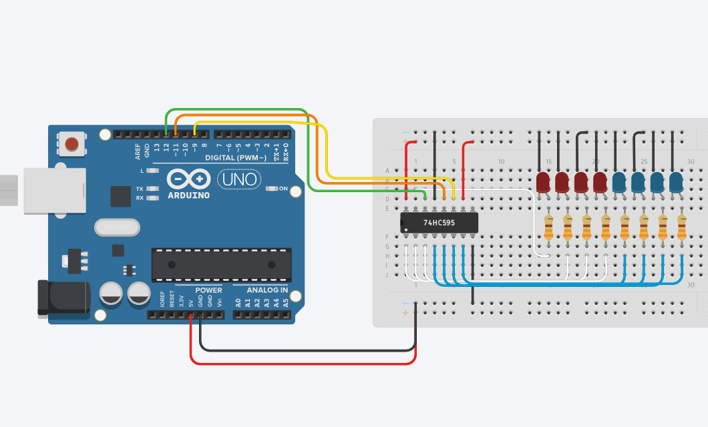

# 8-Bit-Binary-Counter-with-Shift-Register
An 8-bit binary counter (0–255) using only 3 Arduino pins via a 74HC595 shift register.

---
## Demo

---
## Circuit

## Components
* Arduino Uno
* 1x 74HC595 Shift Register
* 8x LED (4x red, 4x blue)
* 8x 330Ω Resistor
* Breadboard + Jumper Wires

## Connections
| Arduino Pin | 74HC595 Pin | Function |
| :--- | :--- | :--- |
| Pin 11 | ST_CP (12) | Latch |
| Pin 9 | SH_CP (11) | Clock |
| Pin 12 | DS (14) | Data |
| 5V | VCC (16), MR (10) | Power |
| GND | GND (8), OE (13) | Ground |

---
## How It Works
The system increments a single 8-bit memory byte (`LED1s`) from `0` to `255`. Instead of using 8 separate digital pins on the Arduino to light up the LEDs, the data is sent serially using just 3 pins linked to a `74HC595` shift register.

Inside the execution `loop()`:

* The `latchPin` is pulled `LOW` to release the storage register lock.

* The `shiftOut()` function streams the `LED1s` byte bit-by-bit into the shift register via `dataPin`, pulsed by the `clockPin` tracking clock cycles (Least Significant Bit first).

The `latchPin` is pulled `HIGH`, transferring the bits to the physical output pins all at once to update the LEDs.

The byte increments by 1 every cycle and resets automatically when it overflows past `255`.

---
## [Comparison with 4-Bit Counter](https://github.com/Kergul08/4-Bit-Binary-Counter)
|  | 4-Bit Counter | 8-Bit Counter |
| :--- | :--- | :--- |
| Arduino Pins Used | 4 | 3 |
| LEDs Controlled | 4 | 8 |
| Method | Direct `digitalWrite()` | Shift register via `shiftOut()` |
| Count range | 0-15 | 0-255 |

---
## Skills
`Arduino` `C++` `Shift Register` `SPI` `Digital Logic` `Bitwise Architecture Tracking`
